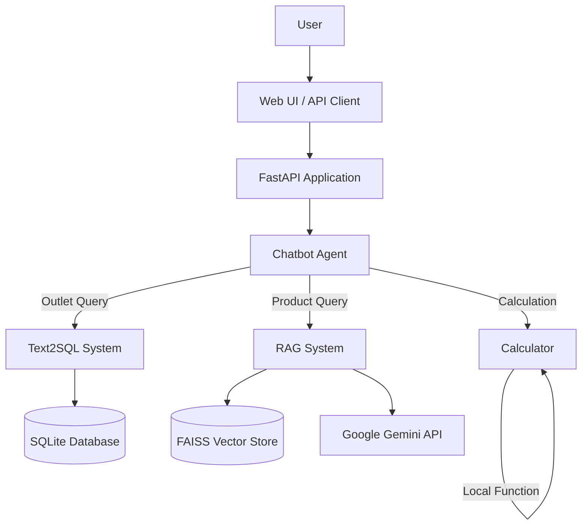
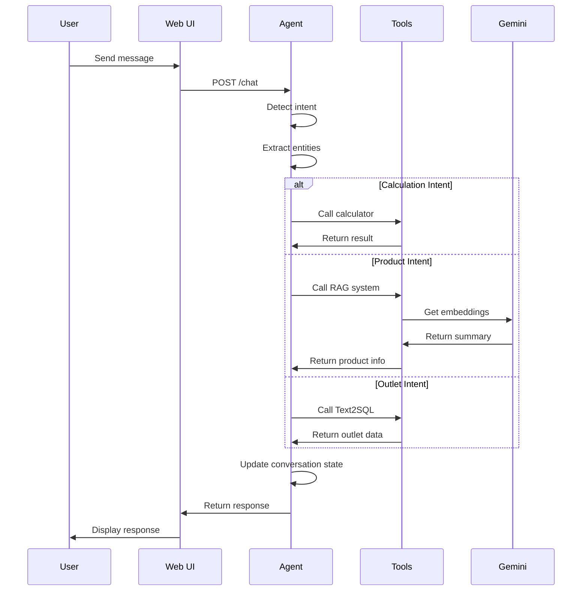
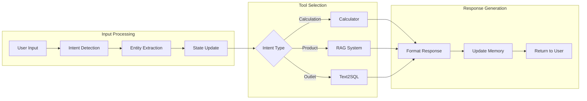
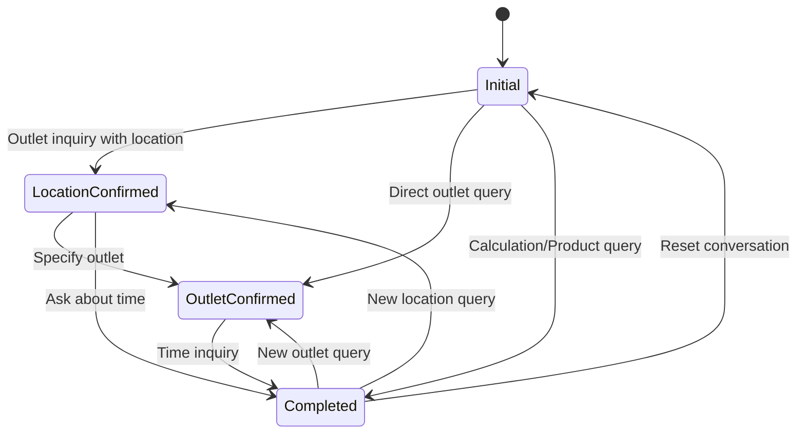
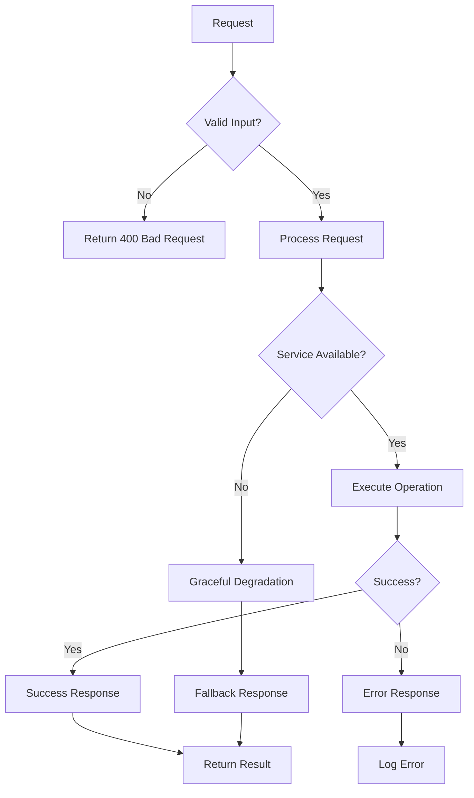

# Architecture Documentation

**Live Demo:** [https://chatbot-engineer-demo.onrender.com/](https://chatbot-engineer-demo.onrender.com/)

## System Overview

The ZUS Coffee AI Chatbot is a production-ready conversational AI system built with modern technologies and best practices. It combines multiple AI capabilities into a unified, user-friendly interface.

## High-Level Architecture



## Core Components

### 1. Frontend Layer
- **Technology**: HTML5, CSS3, JavaScript
- **File**: `static/index.html`
- **Features**: 
  - Real-time chat interface ([see it live](https://chatbot-engineer-demo.onrender.com/))
  - Responsive design
  - Typing indicators
  - Example query suggestions (Calculator, Products, Outlets)

### 2. API Layer
- **Technology**: FastAPI (Python)
- **File**: `main.py`
- **Features**:
  - RESTful API endpoints ([see docs](https://chatbot-engineer-demo.onrender.com/docs))
  - OpenAPI documentation
  - CORS support
  - Error handling middleware

### 3. Chatbot Engine
- **Technology**: Custom Python agent
- **File**: `chatbot/agent.py`
- **Features**:
  - Intent detection and classification
  - Entity extraction
  - State management
  - Tool integration
  - Conversation memory

### 4. RAG System
- **Technology**: FAISS + Google Gemini
- **File**: `chatbot/rag.py`
- **Features**:
  - Vector similarity search
  - AI-generated summaries
  - Product knowledge base
  - Semantic understanding

### 5. Text2SQL System
- **Technology**: SQLite + Pattern matching
- **File**: `database/outlets_db.py`
- **Features**:
  - Natural language to SQL conversion
  - Outlet database management
  - Location and service queries

### 6. Calculator Tool
- **Technology**: Python functions
- **File**: `chatbot/calculator.py`
- **Features**:
  - Arithmetic operations
  - Error handling
  - Input validation

## Conversation Flow



## Data Flow Architecture



## State Management Flow



## Database Schema

### Outlets Table
```sql
CREATE TABLE outlets (
    id INTEGER PRIMARY KEY AUTOINCREMENT,
    name TEXT NOT NULL,
    location TEXT NOT NULL,
    address TEXT NOT NULL,
    opening_hours TEXT NOT NULL,
    phone TEXT,
    services TEXT,
    latitude REAL,
    longitude REAL
);
```

### Sample Data
- 8 ZUS Coffee outlets across Malaysia
- Locations: Petaling Jaya, Kuala Lumpur, Subang, Puchong
- Services: Coffee, Food, WiFi, Drive-thru, Delivery

## Vector Store Architecture

### Product Knowledge Base
- **Technology**: FAISS (Facebook AI Similarity Search)
- **Embeddings**: Google Gemini embedding-001
- **Data Source**: ZUS Coffee drinkware catalog
- **Index Type**: Inverted file index for fast similarity search

### Search Process
1. User query → Text preprocessing
2. Query → Gemini embeddings
3. Vector similarity search in FAISS
4. Top-k results retrieval
5. Context → Gemini 2.0 Flash for summarization
6. Concise, user-friendly response

## Error Handling Architecture



## Security Considerations

### Input Validation
- Parameter type checking
- SQL injection prevention
- Payload size limits
- Malicious input filtering

### Error Handling
- No technical error leaks
- User-friendly error messages
- Comprehensive logging
- Graceful service degradation

### Data Protection
- No sensitive data exposure
- Secure API key handling
- CORS configuration
- Rate limiting (planned)

## Performance Considerations

### Optimization Strategies
- **Lazy Loading**: Heavy components loaded on demand
- **Caching**: Vector store and database caching
- **Async Operations**: Non-blocking API calls
- **Connection Pooling**: Database connection management

### Scalability
- **Stateless Design**: Agent state in memory
- **Modular Architecture**: Independent service components
- **Cloud Deployment**: Render, Railway, Vercel support
- **Horizontal Scaling**: Multiple instances possible

## Deployment Architecture

```mermaid
graph TB
    subgraph "Development"
        A[Local Python] --> B[SQLite]
        A --> C[FAISS Local]
        A --> D[Gemini API]
    end
    
    subgraph "Production"
        E[Render/Railway] --> F[SQLite (persistent)]
        E --> G[FAISS (memory)]
        E --> H[Gemini API]
    end
    
    subgraph "External Services"
        D --> I[Google Cloud]
        H --> I
    end
```

## Monitoring and Logging

### Health Checks
- **Endpoint**: `/health` ([see live](https://chatbot-engineer-demo.onrender.com/health))
- **Services**: All major components
- **Status**: Healthy/Unhealthy indicators

### Logging Strategy
- **Level**: INFO, WARNING, ERROR
- **Context**: Request ID, user session, timestamps
- **Storage**: Application logs (production: external service)

### Metrics
- Response times
- Error rates
- API usage patterns
- User interaction flows

## Future Enhancements

### Planned Improvements
1. **Authentication**: User accounts and session management
2. **Rate Limiting**: API usage controls
3. **Advanced RAG**: Multi-modal search (images, text)
4. **Voice Integration**: Speech-to-text and text-to-speech
5. **Analytics Dashboard**: Usage insights and performance metrics

### Scalability Roadmap
1. **Microservices**: Split into independent services
2. **Message Queue**: Async processing for heavy operations
3. **Distributed Caching**: Redis for session and data caching
4. **Load Balancing**: Multiple instance deployment
5. **CDN Integration**: Static asset optimization

## Technical Stack Summary

| Component | Technology | Purpose |
|-----------|------------|---------|
| Frontend | HTML5/CSS3/JS | User interface |
| Backend | FastAPI (Python) | API server |
| Database | SQLite | Outlet data |
| Vector Store | FAISS | Product search |
| AI Models | Google Gemini | Embeddings & chat |
| Testing | pytest | Test automation |
| Deployment | Render/Railway | Cloud hosting |

## Conclusion

The ZUS Coffee AI Chatbot demonstrates a modern, production-ready architecture that combines multiple AI capabilities into a unified, scalable system. The modular design allows for easy maintenance, testing, and future enhancements while providing a robust foundation for conversational AI applications. 